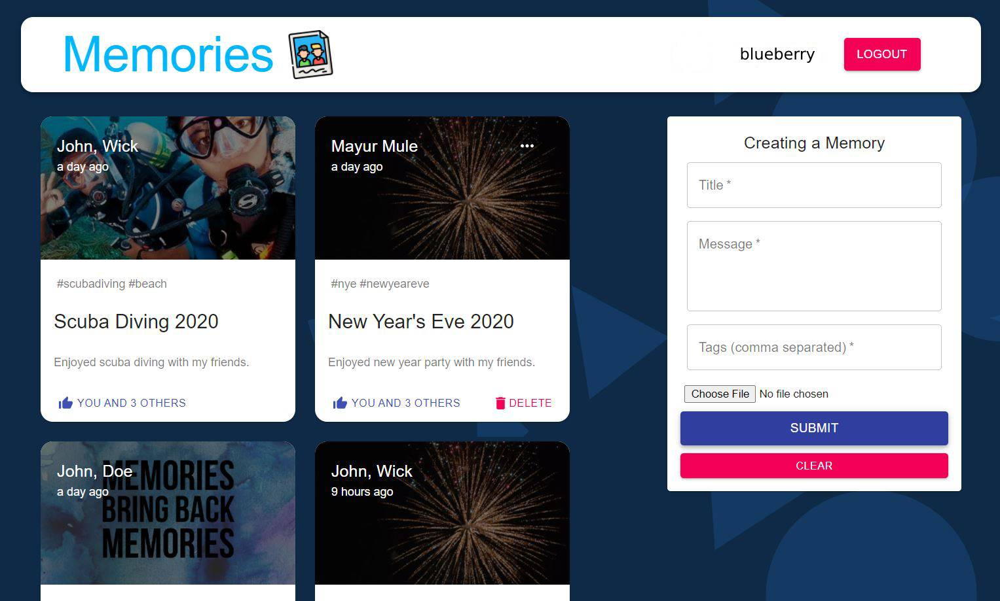

# mern-stack-app-memories

## Summary

**_[Memories](https://mern-stack-app-memories.netlify.app/)_** is a simple application for sharing your memories and viewing other user's memories. This application was created as a code-along project while following the MERN stack tutorials by [JavaScript Mastery](https://www.youtube.com/watch?v=ngc9gnGgUdA&list=PL6QREj8te1P7VSwhrMf3D3Xt4V6_SRkhu).\

 

## Output

 
 

## Application features:

- Sign-In/Sign-Up using email or google account
- Create Posts
- View Posts
- Update Posts
- Delete Posts
- Like Posts

 

## Frameworks/Components used:

Front end:

- React
- Material UI

Back end:

- MongoDB
- Express.js
- Node.js

Authentication:

- Login with Email (JWT)
- Google OAuth

Hosting:

- Back end - Heroku
- Front end - Netlify

 

## Minimal Path to Awesome

- Clone this repository
- Repo structure
  - **client** -> front-end code base
  - **server** -> back-end code base
- Navigate to client folder, in the command-line run:
  - **npm install**
  - **npm run start**
    - Runs the app in the development mode.
    - Open http://localhost:3000 to view it in the browser.
  - **npm run build**
    - Builds the app for production to the build folder.
- Navigate to server folder, in the command-line run:
  - **npm install**
  - **npm run start**
    - Runs the node.js app in the development mode.
    - Open http://localhost:5000 to view it in the browser.
    - Ensure MongoDB Atlas is setup and provide the respective _CONNECTION_URL_
